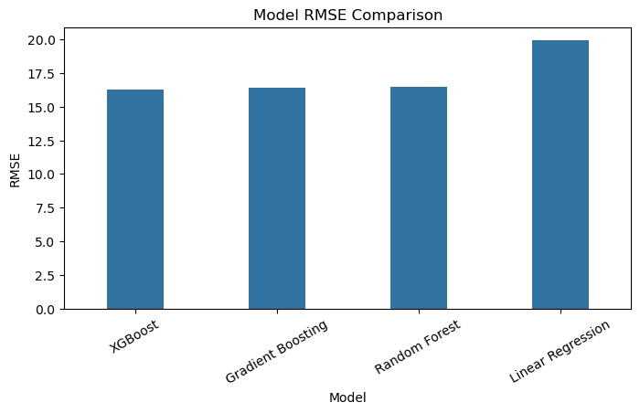
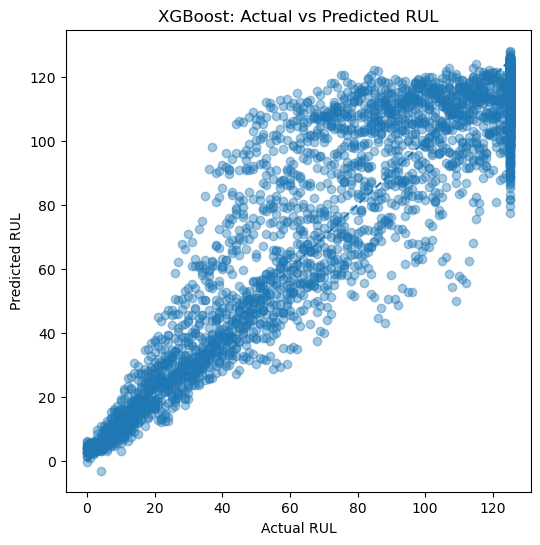
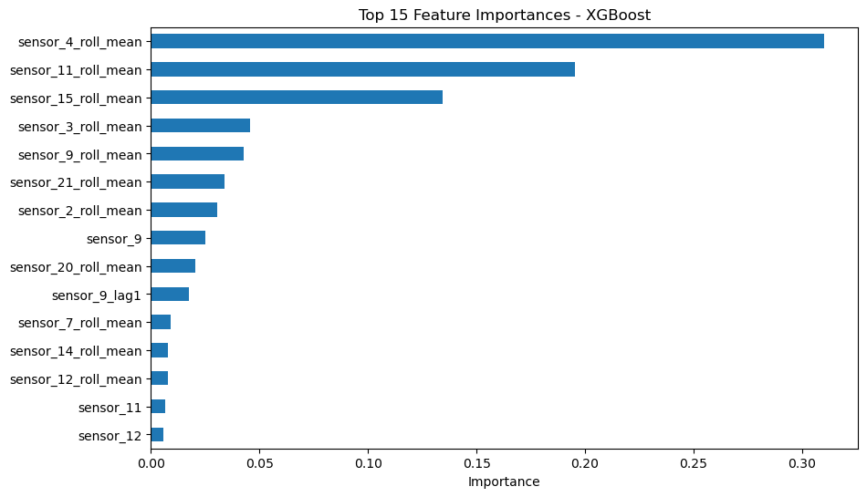

# NASA Turbofan Engine Remaining Useful Life Prediction

## Project Overview

This project develops a machine learning pipeline for predicting the Remaining Useful Life (RUL) of turbofan engines using the NASA CMAPSS predictive maintenance dataset.

The project focuses on:

- Exploratory Data Analysis (EDA)
- Sensor degradation analysis
- Feature engineering
- Leakage-free machine learning modeling
- Predictive maintenance insights

The objective is to estimate how many operating cycles remain before engine failure.

---

## Dataset

Dataset Source:

[NASA CMAPSS Dataset](https://www.kaggle.com/datasets/behrad3d/nasa-cmaps?utm_source=chatgpt.com)

The dataset contains simulated run-to-failure sensor data for multiple turbofan engines.

Each engine includes:

- Operational settings
- Multiple sensor measurements
- Full degradation trajectories until failure

---

## Objective

The goal of this project is to predict Remaining Useful Life (RUL) using sensor measurements and engineered temporal features.

This type of predictive maintenance modeling can help manufacturing systems:

- Reduce unexpected downtime
- Optimize maintenance schedules
- Improve equipment reliability
- Lower operational costs

---

## Workflow

1. Exploratory Data Analysis (EDA)
2. Sensor Selection
3. Feature Engineering
4. Leakage-Free Model Training
5. Model Evaluation
6. Predictive Maintenance Insights

---

## Exploratory Data Analysis

EDA focused on:

- Engine lifetime distribution
- Sensor degradation behavior
- Correlation analysis
- Remaining Useful Life (RUL) generation
- Degradation visualization aligned by RUL

Several sensors showed clear degradation patterns as failure approached.

---

## Feature Engineering

Temporal features were created to better capture degradation dynamics, including:

- Rolling means
- Rolling standard deviations
- First-order differences
- Lag features
- Slope-based trend features

RUL clipping was also applied to reduce noise during healthy operating phases.

---

## Modeling

The following models were evaluated:

- Linear Regression
- Random Forest Regressor
- Gradient Boosting Regressor
- XGBoost Regressor

To avoid leakage, the dataset was split by engine ID rather than random row sampling.

---

## Results

| Model | RMSE | MAE | R² |
|---|---|---|---|
| XGBoost | 16.27 | 11.55 | 0.848 |
| Gradient Boosting | 16.39 | 11.73 | 0.846 |
| Random Forest | 16.45 | 11.56 | 0.845 |
| Linear Regression | 19.90 | 16.01 | 0.773 |

Tree-based ensemble models significantly outperformed Linear Regression, indicating nonlinear degradation behavior within the dataset.

---

## Model Comparison

---

## Actual vs Predicted RUL

---

## Feature Importance

---

## Key Insights

- Sensor degradation becomes more pronounced as engines approach failure.
- Temporal sensor behavior is more predictive than raw sensor values alone.
- Feature engineering substantially improved model performance.
- Leakage-free engine-based splitting is critical for realistic evaluation.

---

## Predictive Maintenance Insights

This project demonstrates how machine learning can support predictive maintenance strategies by estimating engine health using operational sensor data.

In manufacturing environments, similar approaches can help:

- Reduce unexpected downtime
- Improve equipment reliability
- Lower maintenance costs
- Enable proactive maintenance scheduling

---

## Limitations

Several limitations remain in the current approach:

- The dataset is simulated rather than real industrial data.
- Temporal dependencies were approximated using engineered features rather than sequence models.
- Hyperparameter tuning was limited.
- Operating conditions were not deeply modeled.

---

## Future Improvements

Potential future improvements include:

- Hyperparameter optimization
- Advanced temporal modeling
- Sequence-based deep learning (LSTM / Transformer)
- Operating-condition-aware normalization
- Real-time deployment pipeline

---

## Technologies Used

- Python
- pandas
- NumPy
- scikit-learn
- XGBoost
- matplotlib
- seaborn

---

## Author

Jung Han Lee